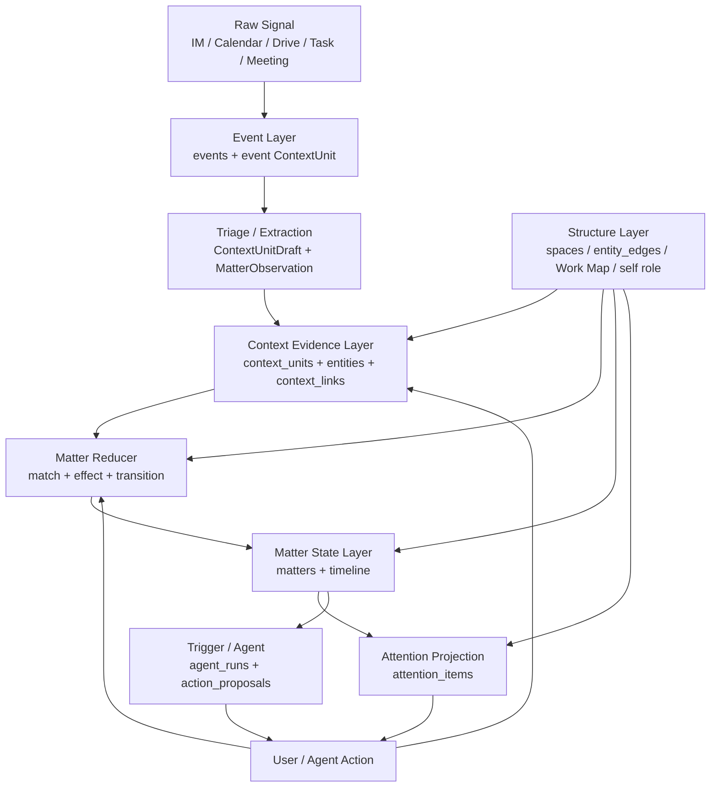

# MVP26-MVP29 · Matter 事务状态层技术方案

> 目标：在现有 Event → Triage → Context → Trigger/Agent → Attention 链路中，新增一层可持续演进的 **Matter（事项 / 事务原子）**。Context 继续作为证据层；Matter 负责把证据归并成“这件事现在推进到哪了”；Attention 只把当前值得用户看的 Matter 投影出来。

## 0. TL;DR

当前系统已经具备大量可复用基础：

- collector 把飞书 IM / 日历 / 云文档 / 任务 / 会议纪要写入 `events`。
- `triageQueue` 把 raw event 提取成 `ContextUnit`，并通过 `context_links` 连接 event unit 与语义 unit。
- `contextStore.upsertContextUnit()` 已有 mergeKey、entity 解析、upsert hook、routing materialize。
- `context_spaces / context_space_links / entity_edges / work_item_edges` 已经承载项目、协作圈和 ContextUnit 间的 follows 边。
- `triggerScheduler / AgentRunQueue / attentionEngine` 已经能在 context 变化后触发 agent 与 attention 重算。

缺的不是“读更多 context”，而是一个持久的状态收拢层：

```text
Event
  -> Triage / Extraction
  -> ContextUnit evidence
  -> Matter Reducer
  -> Matter state
  -> Attention projection
```

Matter 的职责是回答：

> 新 context 是否改变了某个正在进行的事项？如果改变了，是创建、推进、阻塞、解决、重开，还是无关？

但 Matter 自动闭环有一个前提：用户在别处推进事项的行为必须先进入事件流。当前 IM collector 已经让“我”侧消息作为上下文可见，但不会让 me-side 单条消息单独成为 signal。因此“我主动拉群 / @某人同步 / 发出方案”这类 self-initiated action，在没有对方回复或 peer burst 的情况下不会进入 triage，也就不会产生 `action_result`。MVP26.5 专门补这条输入管道。

典型修复场景：

1. IM 中出现“我直接拉 yufan 说一下？”。
2. Triage 提取 `ContextUnit(kind='commitment')`。
3. Matter Reducer 创建 Matter：`安排与 yufan 讨论`，状态 `open`。
4. 用户后来在别的群里拉了 yufan。
5. Triage 提取 `ContextUnit(kind='action_result')`。
6. Matter Reducer 关联该 action_result 到原 Matter，并把 Matter 状态改为 `resolved`。
7. Attention 不再提醒“安排与 yufan 讨论”，旧 live attention 被 supersede。

建议拆成 5 个 MVP：

| 阶段 | 内容 | 行为变化 | 风险 |
|---|---|---|---|
| MVP26 | Matter schema + store + debug read model + 历史 commitment seed | 只新增可观察状态，不影响提醒 | 低 |
| MVP26.5 | Self-initiated action signal：把用户在 IM 中主动推进事项的消息升格为可 triage 信号 | 给 Matter Reducer 接上 action_result 输入 | 中 |
| MVP27 | Context upsert 后运行 Matter Reducer，先覆盖 commitment/action_result | 能解决“已处理但仍提醒”的核心问题 | 中 |
| MVP28 | Attention / Trigger 改为优先消费 Matter | 卡片从 context 驱动变成 matter 驱动 | 中高 |
| MVP29 | Triage 输出 MatterObservation + UI 纠错/合并/拆分 | 准确率与可控性提升 | 中 |

重要约束：

- **不要复用 `context_units.status` 表示事项生命周期**。现有 `status` 是记录可见性：`active | archived | superseded`。Matter 生命周期应放在 `matters.status`。
- **Triage 是处理过程，Context 是处理结果，Matter 是持续状态**。Triage 可以给观察和候选，但不直接关闭 Matter。
- **Matter 不保存大段原文**。Matter 只保存摘要、状态、关联实体，以及 evidence 的 `context_unit_id`。原始证据仍回查 `events / context_units`。

---

## 1. 问题定义

### 1.1 当前症状

当前 attention 和 commitment agent 会遇到这类问题：

```text
安排与 yufan 讨论
executor commitment 1c096c22 尚未安排，无截止时间。
建议：今天主动约 yufan 同步并补截止时间。
```

但用户可能已经在另一个群聊或另一个 context 中拉了 yufan。系统没有把“后续动作”归并回原始 commitment，于是旧 context 仍然活跃，attention 继续提醒。

这不是单个 prompt 的问题，而是缺少一层“正在进行的事”的状态模型。

### 1.2 为什么只让 A context 读更多信息不够

如果让每个 agent / attention tick 都自己读取更多 context，会产生几个问题：

- 每个消费方都要重复做跨 context 关联判断。
- 判断结果不持久，下次仍要重算。
- 不同 agent 可能对同一组证据给出不同结论。
- 用户纠错无法稳定回写到底层状态。
- context 越多，attention 输入越大，噪声越高。

正确方向是把“同一件事的发展过程”收拢成一等实体。

### 1.3 Matter 的定义

Matter 是一个持续演进的事项本体：

- 它不是 raw event。
- 它不是单条 context。
- 它不是 attention item。
- 它是“这件正在发生的事”的当前状态。

例如：

```text
Matter: 安排与 yufan 讨论记忆召回设计
status: resolved
summary: 已通过群聊联系 yufan，讨论已进入直接沟通状态
evidence:
  - commitment: 我准备联系 yufan
  - action_result: 已拉 yufan 进群讨论
```

---

## 2. 现有代码分层对照

### 2.1 总览

| 目标分层 | 当前代码 / 表 | 当前状态 | 复用方式 |
|---|---|---|---|
| Raw Signal / Event | `collectors/*Collector.ts`, `events` | 已有 | 直接复用 |
| Triage / Extraction | `triage/triagePrompt.ts`, `triageQueue.ts`, `parseTriage.ts` | 已有，主输出是 `contextUpdates` | 扩展输出 `matterObservations` |
| Context Evidence | `context/ContextUnit.ts`, `contextStore.ts`, `context_units`, `context_entities`, `context_links` | 已有 | 作为 Matter evidence 层 |
| Source routing | `unit_sources`, `unit_routing_cache`, `contextSpaceService.ts` | 已有 | Matter 候选匹配时复用 |
| Structure / Space | `context_spaces`, `context_space_links`, `entity_edges`, Work Map | 已有 | 给 Matter 关联项目、人、协作圈 |
| ContextUnit edge | `work_item_edges`, `workItemInducer.ts` | 部分已有 | 作为 Matter timeline 的低层证据 |
| Trigger / Agent | `triggerScheduler.ts`, `triggerEvaluator.ts`, `AgentRunQueue.ts`, `agentContextAssembler.ts` | 已有 | MVP28 改为优先读 Matter |
| Attention | `attentionEngine.ts`, `attentionPrompt.ts`, `attentionInteractions.ts`, `attentionFeedback.ts` | 已有 | MVP28 增加 `<matters>` slice |
| Matter State | 无 | 缺失 | 新增 |

### 2.2 Event 层：可直接复用

当前 `events` 表已经满足 Matter 的输入需求：

- `source / source_id / kind / occurred_at`
- `title / text / actor / url / raw_json`
- `content_hash` 去重
- `context_extracted_at` 表示是否已经完成 context enrichment

collector 已经把 IM 双向消息、群聊、会议纪要、云文档评论等标准化为 event。Matter 不应直接读各 SaaS 原始 API，而应从 `events` 和对应 `ContextUnit(kind='event')` 读证据。

### 2.3 Triage 层：可复用但需要扩展

当前 Triage 做两件事：

1. 对 event 进行优先级、相关性、建议动作判断。
2. 输出 `contextUpdates`，由 `triageQueue.persistContextUpdates()` 写入 `context_units`。

MVP14 后旧 `triage_results / cards(source_kind='triage')` 路径已经基本下线，Triage 主要是 context enrichment。

现有强点：

- prompt 已经区分 `commitment / action_result / decision / uncertainty`。
- MVP16-A 已让 IM 文本包含“我”侧消息，支持识别“我已经回应 / 已经做了”。
- `parseTriage.ts` 已有 JSON repair 与字段白名单。
- `triageQueue.ts` 已经把 event unit 与 semantic unit 用 `context_links(link_type='updates')` 连接。

需要扩展：

- 增加 `MatterObservation` 输出，描述“这条 event 看起来在创建/推进/完成/阻塞某件事”。
- 不让 Triage 直接修改 Matter 状态；最终裁决放在 Matter Reducer。

### 2.4 Context 层：可作为 Matter 的证据层

当前 `ContextUnit` 已经覆盖 Matter 所需的大多数语义材料：

```ts
type ContextUnit = {
  kind:
    | 'event'
    | 'state'
    | 'goal'
    | 'intent'
    | 'commitment'
    | 'relationship'
    | 'memory'
    | 'emotion'
    | 'constraint'
    | 'uncertainty'
    | 'action_result'
    | 'decision'
    | 'preference';
  title: string;
  content: string;
  entities: ContextEntityRef[];
  time?: ContextTimeInfo;
  origin: { kind: ContextOriginKind; refId: string };
  mergeKey?: string;
  status: 'active' | 'archived' | 'superseded';
};
```

可直接复用：

- `mergeKey` 用于同类 context upsert。
- `context_unit_entities` 用于关联人、项目、文档、任务。
- `context_links` 用于 event → semantic unit、action_result → commitment 等证据关系。
- `unit_sources / unit_routing_cache` 用于从 source event 找 chat/doc/app routing evidence。
- `classifyContextUnit()` 用于区分 `work_map_seed / triage / collector / manual / card_action`。

需要注意：

- `ContextUnit.status` 不表示 commitment 是否完成。它只表示这条记录是否活跃。
- Matter 的 `resolved / waiting / in_progress` 应放在新表，不要写进 `context_units.status`。

### 2.5 Structure 层：可复用

Matter 需要知道“这件事属于哪个项目 / 哪些人 / 哪个群聊 / 哪个文档”。现有结构层已经较完整：

- `context_entities`：person / project / doc / task / chat / app。
- `context_spaces`：项目或主题空间。
- `context_space_links`：unit/entity 到 space 的 routing。
- `entity_edges`：person-person、person-project 协作关系。
- `selfRoleOnUnit.ts`：推断 self 在 commitment 上是 executor / requester / reviewer / observer。
- `graphContextAssembler.ts`：聚合 decisionPath、activeBlockers、expectedButMissing。

Matter Reducer 匹配时应复用这些结构，而不是重新发明项目和协作网络。

### 2.6 `work_item_edges`：部分可复用

当前 `work_item_edges` 表记录的是 `ContextUnit ↔ ContextUnit` 的关系：

```text
context_links.updates: B updates A
  -> work_item_edges: A follows B
```

它有价值，但它还不是 Matter。

复用方式：

- 作为 Matter evidence graph 的底层输入。
- 用于 timeline 展示“这条 context 是哪条 context 的后续”。
- 在 Reducer 里作为候选关联特征。

不建议把 `work_item_edges` 直接改造成 Matter：

- 它没有 title / status / nextAction / owner / summary。
- 它的节点是 ContextUnit，不是事项本体。
- 一个 Matter 可以挂多条 ContextUnit 和多条 edge。

### 2.7 Trigger / Agent / Attention：现有链路应后移消费 Matter

当前启动顺序：

```ts
startCollectorScheduler();
startTriggerScheduler();
startAttentionScheduler();
```

`triggerScheduler` 与 `attentionEngine` 都通过 `registerUpsertHook()` 响应 `ContextUnit` 更新。

Matter 上线后，推荐变成：

```ts
startCollectorScheduler();
startMatterTracker();      // 注册 upsert hook
startTriggerScheduler();   // 读已归并 Matter / Context
startAttentionScheduler(); // 读已归并 Matter / Context
```

原因：Matter Reducer 应该先把“已完成 / 已推进 / 已阻塞”的状态归并好，然后 Trigger 和 Attention 再决定是否提醒。

实现注意：当前 `resolveUnitToSpaces(unit)` 是在 `triggerScheduler` 的 hook 内调用的。如果 Matter hook 注册在 trigger hook 之前，Matter Reducer 不能假设新 unit 已经完成 Space routing。MVP27 需要二选一：

1. 在 `startMatterTracker()` 的 hook 开头主动调用 `resolveUnitToSpaces(unit)`。
2. 或抽出独立 `startContextRouting()`，先注册 routing hook，再注册 Matter / Trigger / Attention。

否则 Matter 匹配会漏掉“新 context 所在 Space”这个重要特征。

---

## 3. 目标分层架构

### 3.1 分层图



### 3.2 各层职责

| 层 | 职责 | 不负责 |
|---|---|---|
| Event | 标准化原始信号 | 不做事项状态判断 |
| Triage | 从 event 抽语义观察 | 不直接维护 Matter |
| Context | 保存证据事实 | 不表达“这件事整体到哪了” |
| Matter Reducer | 判断新证据如何影响事项 | 不保存 raw 原文 |
| Matter | 保存事项当前状态与 timeline | 不直接执行动作 |
| Attention | 展示此刻值得看的事项 | 不做底层事实仲裁 |
| Action | 用户 / Agent 的实际操作 | 操作结果必须回写 Context / Matter |

### 3.3 Triage 与 Context 的关系

Triage 是动词，Context 是名词。

```text
Triage = extraction / interpretation process
Context = extracted semantic facts
```

Triage 可以短暂召回 active Matter，但它输出的是观察：

- 这像是一个新事项。
- 这像是在推进某事项。
- 这像是某事项已完成。
- 这像是某事项被阻塞。

最终是否创建 / 关闭 / 重开 Matter，由 Matter Reducer 决定。

### 3.4 Context 与 Matter 的关系

Context 是证据层；Matter 是状态层。

一个 Matter 可以关联多条 ContextUnit：

```text
Matter: 安排与 yufan 讨论
  - ContextUnit(commitment): 我直接拉 yufan 说一下？
  - ContextUnit(action_result): 已拉 yufan 进群
  - ContextUnit(event): 群聊里 yufan 已回应
```

一条 ContextUnit 也可以影响多个 Matter，例如一次会议纪要可能同时推进多个 action item。

---

## 4. 核心实体设计

### 4.1 Matter

```ts
export type MatterType =
  | 'follow_up'
  | 'discussion'
  | 'review'
  | 'delivery'
  | 'decision'
  | 'coordination'
  | 'blocker'
  | 'other';

export type MatterStatus =
  | 'open'
  | 'acknowledged'
  | 'in_progress'
  | 'waiting'
  | 'blocked'
  | 'resolved'
  | 'dropped';

export type Matter = {
  id: string;
  subjectId: string;
  scope: 'personal' | 'work' | 'team';
  type: MatterType;
  title: string;
  canonicalKey: string;

  status: MatterStatus;
  priority: 'P0' | 'P1' | 'P2' | 'P3';

  ownerEntityId?: string | null;
  primarySpaceId?: string | null;
  dueAt?: string | null;

  currentSummary: string;
  nextAction?: string | null;

  createdFromContextUnitId: string;
  lastEvidenceContextUnitId?: string | null;
  lastEvidenceAt?: string | null;

  confidence: number;
  reopenedCount: number;
  version: number;

  createdAt: string;
  updatedAt: string;
  resolvedAt?: string | null;
  droppedAt?: string | null;
};
```

### 4.2 Matter Entity Link

Matter 需要显式记录参与人、目标对象、容器等，避免每次都从 evidence 反推。

```ts
export type MatterEntityRole =
  | 'owner'
  | 'requester'
  | 'executor'
  | 'reviewer'
  | 'participant'
  | 'target'
  | 'about'
  | 'container';

export type MatterEntityLink = {
  matterId: string;
  entityId: string;
  role: MatterEntityRole;
  confidence: number;
  createdAt: string;
};
```

### 4.3 Matter Context Link

这是 Matter 与 Context evidence 的核心关系。

```ts
export type MatterContextRelation =
  | 'created_by'
  | 'evidence'
  | 'progressed_by'
  | 'resolved_by'
  | 'blocked_by'
  | 'reopened_by'
  | 'contradicted_by'
  | 'dismissed_by';

export type MatterContextLink = {
  matterId: string;
  contextUnitId: string;
  relation: MatterContextRelation;
  effect:
    | 'create'
    | 'progress'
    | 'resolve'
    | 'block'
    | 'reopen'
    | 'drop'
    | 'no_change';
  confidence: number;
  reason: string;
  createdAt: string;
};
```

### 4.4 Matter Transition

每次状态变化都落 transition，便于审计和纠错。

```ts
export type MatterTransition = {
  id: string;
  matterId: string;
  fromStatus: MatterStatus | null;
  toStatus: MatterStatus;
  triggerContextUnitId: string;
  effect: MatterContextLink['effect'];
  reason: string;
  confidence: number;
  createdAt: string;
};
```

### 4.5 Matter Observation

MVP29 才需要让 Triage 直接输出。MVP27 可以先由 Reducer 从 `ContextUnit` 派生。

```ts
export type MatterObservation = {
  sourceEventId: string;
  contextUnitIds: string[];

  observationType:
    | 'possible_new_matter'
    | 'progress'
    | 'resolution'
    | 'blocker'
    | 'reopen'
    | 'status_hint';

  matterType: MatterType;
  title: string;
  candidateAction?: string;
  lifecycleEffect?: 'create' | 'advance' | 'resolve' | 'block' | 'reopen';

  participants: ContextEntityRef[];
  relatedEntities: ContextEntityRef[];
  evidence: string;
  confidence: number;
};
```

---

## 5. Proposed Schema

### 5.1 `matters`

```sql
CREATE TABLE IF NOT EXISTS matters (
  id TEXT PRIMARY KEY,
  subject_id TEXT NOT NULL DEFAULT 'me',
  scope TEXT NOT NULL,

  type TEXT NOT NULL,
  title TEXT NOT NULL,
  canonical_key TEXT NOT NULL,

  status TEXT NOT NULL DEFAULT 'open',
  priority TEXT NOT NULL DEFAULT 'P2',

  owner_entity_id TEXT,
  primary_space_id TEXT,
  due_at TEXT,

  current_summary TEXT NOT NULL DEFAULT '',
  next_action TEXT,

  created_from_context_unit_id TEXT NOT NULL,
  last_evidence_context_unit_id TEXT,
  last_evidence_at TEXT,

  confidence REAL NOT NULL DEFAULT 0.7,
  reopened_count INTEGER NOT NULL DEFAULT 0,
  version INTEGER NOT NULL DEFAULT 1,

  created_at TEXT NOT NULL,
  updated_at TEXT NOT NULL,
  resolved_at TEXT,
  dropped_at TEXT
);
CREATE INDEX IF NOT EXISTS idx_matters_status_updated ON matters(status, updated_at);
CREATE INDEX IF NOT EXISTS idx_matters_canonical_key ON matters(canonical_key);
CREATE INDEX IF NOT EXISTS idx_matters_due_at ON matters(due_at);
```

`canonical_key` 用于候选召回、幂等提示和低成本防重复，不作为数据库硬唯一约束。初版可由以下字段 hash：

```text
subjectId | sorted primary entity ids | canonical action phrase
```

不要把 `type` 放进 `canonical_key`。Matter type 可能随后续证据从 `follow_up` 调整为 `discussion` 或 `delivery`，如果 type 参与 key，会把同一事项拆成多个 Matter。

也不要直接用 `ContextUnit.mergeKey`，因为一个 Matter 可能跨多类 ContextUnit：commitment、action_result、decision、event。

不建议建立 `UNIQUE(subject_id, canonical_key) WHERE active`。同一个人、同一个粗动作短语下可能同时存在多件不同事务，例如“跟 yufan 讨论记忆召回”和“跟 yufan 讨论排期”。如果 canonicalization 都归成“安排与 yufan 讨论”，数据库唯一约束会在 insert 时强行合并，绕过 Matter Matcher 的实体召回、规则评分、LLM 判定和低置信 evidence attach 防护。

若后续确实需要更强幂等，可以新增更细的 `dedupe_fingerprint`，把主对象/主文档/主 project 或 triage 明确抽出的 topic slot 纳入 fingerprint；但 MVP 不用 DB 唯一键承担语义合并。

### 5.2 `matter_entities`

```sql
CREATE TABLE IF NOT EXISTS matter_entities (
  matter_id TEXT NOT NULL,
  entity_id TEXT NOT NULL,
  role TEXT NOT NULL DEFAULT 'about',
  confidence REAL NOT NULL DEFAULT 0.7,
  created_at TEXT NOT NULL,
  PRIMARY KEY (matter_id, entity_id, role)
);
CREATE INDEX IF NOT EXISTS idx_matter_entities_matter ON matter_entities(matter_id);
CREATE INDEX IF NOT EXISTS idx_matter_entities_entity ON matter_entities(entity_id);
```

### 5.3 `matter_context_links`

```sql
CREATE TABLE IF NOT EXISTS matter_context_links (
  matter_id TEXT NOT NULL,
  context_unit_id TEXT NOT NULL,
  relation TEXT NOT NULL,
  effect TEXT NOT NULL,
  confidence REAL NOT NULL DEFAULT 0.7,
  reason TEXT NOT NULL,
  created_at TEXT NOT NULL,
  PRIMARY KEY (matter_id, context_unit_id, relation)
);
CREATE INDEX IF NOT EXISTS idx_mcl_matter ON matter_context_links(matter_id);
CREATE INDEX IF NOT EXISTS idx_mcl_context ON matter_context_links(context_unit_id);
```

### 5.4 `matter_transitions`

```sql
CREATE TABLE IF NOT EXISTS matter_transitions (
  id TEXT PRIMARY KEY,
  matter_id TEXT NOT NULL,
  from_status TEXT,
  to_status TEXT NOT NULL,
  trigger_context_unit_id TEXT NOT NULL,
  effect TEXT NOT NULL,
  reason TEXT NOT NULL,
  confidence REAL NOT NULL DEFAULT 0.7,
  created_at TEXT NOT NULL
);
CREATE INDEX IF NOT EXISTS idx_matter_transitions_matter ON matter_transitions(matter_id, created_at);
CREATE INDEX IF NOT EXISTS idx_matter_transitions_context ON matter_transitions(trigger_context_unit_id);
```

### 5.5 `matter_observations`（MVP29）

```sql
CREATE TABLE IF NOT EXISTS matter_observations (
  id TEXT PRIMARY KEY,
  source_event_id TEXT NOT NULL,
  context_unit_ids_json TEXT NOT NULL DEFAULT '[]',
  observation_type TEXT NOT NULL,
  matter_type TEXT NOT NULL,
  title TEXT NOT NULL,
  lifecycle_effect TEXT,
  evidence TEXT NOT NULL,
  confidence REAL NOT NULL DEFAULT 0.7,
  candidate_matter_ids_json TEXT NOT NULL DEFAULT '[]',
  raw_json TEXT NOT NULL,
  created_at TEXT NOT NULL
);
CREATE INDEX IF NOT EXISTS idx_matter_observations_event ON matter_observations(source_event_id);
CREATE INDEX IF NOT EXISTS idx_matter_observations_type ON matter_observations(observation_type);
```

### 5.6 Space link 复用

Matter 与 Space 的关系可以先复用现有 `context_space_links`：

```text
context_space_links.target_type = 'matter'
context_space_links.target_id = matters.id
```

这样不必新增 `matter_space_links`。`matters.primary_space_id` 只保存主归属，多个 Space 归属由 `context_space_links` 承载。

实现注意：当前 `ContextSpaceLinkRow.target_type` 的 TS 注释仍写着 `'entity' | 'context_unit'`，但表没有 CHECK 约束，`listSpacesForTarget(targetType, targetId)` 也接受任意字符串。使用 `target_type='matter'` 时，需要同步更新类型注释和所有消费 `context_space_links` 的 UI/assembler 逻辑，避免默认只处理 entity/context_unit。

---

## 6. Matter Reducer

### 6.1 入口

Matter Reducer 在 `ContextUnit` upsert 后运行：

```text
upsertContextUnit()
  -> materializeRoutingForUnit()
  -> invokeHook(unit, changeContext)
     -> MatterTracker hook
     -> TriggerScheduler hook
     -> AttentionScheduler hook
```

上线时应确保 Matter hook 先注册。

实现注意：`contextStore.upsertContextUnit()` 的 update 分支传入 hook 的 `unit.entities` 只包含本次 input 里的 `entityRefs`，不一定是数据库里该 unit 的完整实体集合。Matter Reducer 进入时应使用 `getContextUnitById(unit.id)` 重新 hydrate 一次，再做匹配；否则更新类 context 可能因为 entities 不全而漏匹配。

### 6.2 Reducer 输入

```ts
type ReduceInput = {
  unit: ContextUnit;
  changeContext?: ChangeContext;
  now: number;
};
```

主要处理这些 kind：

| ContextUnit kind | Matter 影响 |
|---|---|
| `commitment` | 创建 / 更新 Matter，设置 dueAt / nextAction |
| `intent` | 创建轻量 Matter 或更新 nextAction |
| `action_result` | 推进 / resolve Matter |
| `decision` | 更新 summary，可能 resolve discussion/decision Matter |
| `uncertainty` | 标记 waiting / blocked |
| `event` | 作为辅助证据，通常不直接创建 Matter |
| `state / relationship / preference` | 通常只影响结构，不直接更新 Matter |

### 6.3 候选 Matter 召回

因为 active Matter 数量预计不多，可以做较宽召回：

1. 默认查 `status IN ('open','acknowledged','in_progress','waiting','blocked')`。
2. 最近 90 天更新过。
3. 与新 unit 有任一实体重叠。
4. 或与新 unit 所在 Space 重叠。
5. 或与新 unit 的 source event / chat / doc routing entity 重叠。
6. 或 `matter_context_links` 中已有相关 context 的邻居。
7. 若新 unit 带有 reopen 迹象（对方再次催促、明确说未收到/未完成、同 canonical action phrase 再次出现），额外召回最近 30 天 `status='resolved'` 的 Matter；`dropped` 仍默认不自动召回，只允许用户手动 reopen。

候选上限建议 30，进入 scoring 后取 top 8 给 LLM 判定。

### 6.4 规则评分

先做 cheap scoring，避免每条都打 LLM：

| 特征 | 加分 |
|---|---|
| person entity 重叠 | +0.35 |
| project / space 重叠 | +0.30 |
| doc / task entity 重叠 | +0.25 |
| chat container 重叠 | +0.20 |
| action phrase / title 相似 | +0.25 |
| 新 unit 发生在 Matter 创建之后 | +0.10 |
| 新 unit kind 是 `action_result` 且 Matter 有 open commitment | +0.25 |
| selfRole 一致，例如 executor commitment + 我侧 action_result | +0.20 |
| status 已 `resolved/dropped` 且无 reopen 迹象 | -0.40 |

### 6.5 LLM 判定

对 top candidates 调轻量 LLM，输入只包含：

- new unit 的 title/content/entities/time/source。
- top 8 Matter sketches。
- 每个 Matter 最近 3 条 evidence。

输出：

```ts
type MatterReduceDecision = {
  action: 'create' | 'attach' | 'ignore';
  matterId?: string;
  effect?: 'progress' | 'resolve' | 'block' | 'reopen' | 'drop' | 'no_change';
  status?: MatterStatus;
  title?: string;
  summaryPatch?: string;
  nextAction?: string | null;
  confidence: number;
  reason: string;
};
```

阈值建议：

- `confidence >= 0.78`：自动写入。
- `0.55 <= confidence < 0.78`：只写 `matter_context_links(relation='evidence')`，不改 status，或进入 debug queue。
- `< 0.55`：ignore。

### 6.6 状态机

```text
open
  -> acknowledged
  -> in_progress
  -> waiting
  -> blocked
  -> resolved

resolved -> open / in_progress / waiting 允许重开，reopened_count +1
dropped 是用户主动放弃，默认不可自动重开
```

状态含义：

| status | 含义 |
|---|---|
| `open` | 事项已被发现，但还没有明确推进 |
| `acknowledged` | 已确认要做 / 已收到 |
| `in_progress` | 有明确进行中证据 |
| `waiting` | 当前等待别人 / 等外部条件 |
| `blocked` | 有阻塞或不确定性 |
| `resolved` | 已完成 / 已进入不需提醒状态 |
| `dropped` | 用户主动放弃 / 判定不相关 |

### 6.7 写入顺序

一次 Reducer 成功写入应包括：

1. upsert Matter。
2. upsert `matter_entities`。
3. insert / upsert `matter_context_links`。
4. 如果 status 改变，insert `matter_transitions`。
5. 可选：写 `context_links(action_result -> commitment, 'updates' 或 'satisfies')`，兼容现有 `workItemInducer`。
6. 广播 `matter_updated`，触发前端刷新。

注意：当前 `context_links` 表没有 `(from_context_id, to_context_id, link_type)` 唯一约束，`insertContextLink()` 也是直接 insert。因此兼容写 `context_links` 时必须新增幂等 helper，或先查重再插入，避免 Reducer 重跑时堆重复 link。

---

## 7. Attention 与 Trigger 的变化

### 7.1 现状

当前 `assembleGlobalContextPacket()` 直接收：

- `commitments`
- `goals`
- `uncertainties`
- `recentEvents`
- `topActive`
- `agentProposals`
- `currentAttention`

Attention prompt 需要自己判断旧 item 是否仍有效。

### 7.2 目标

新增 `<matters>` slice，让 Attention 优先看 Matter：

```ts
type MatterInPacket = {
  id: string;
  title: string;
  type: MatterType;
  status: MatterStatus;
  priority: Priority;
  dueAt?: string;
  currentSummary: string;
  nextAction?: string;
  owner?: string;
  participants: string[];
  spaces: Array<{ id: string; name: string }>;
  latestEvidence: Array<{
    contextUnitId: string;
    kind: ContextUnitKind;
    title: string;
    effect: string;
    at: string;
  }>;
};
```

Attention 规则变化：

- `resolved / dropped` Matter 默认不出 item。
- `waiting` Matter 只在超时或有新证据时出 item。
- `blocked` Matter 优先级上调。
- `open` Matter 若 long-stale 或 dueAt 临近才出。
- 旧 attention 若绑定同 Matter 且 Matter 已 resolved，自动 supersede。

### 7.3 Trigger 变化

MVP27 先不改 Trigger，仍由 `ContextUnit(kind='commitment')` 触发。

MVP28 后：

- `commitment_due` 应优先基于 Matter dueAt / status 判断。
- `trackCommitmentHandler` 应读 Matter 状态，若 Matter 已 resolved/dropped，直接跳过。
- `context_divergence` 可从 Space + Matter 的 stale/open 状态推断，而不是只看 ContextUnit。

---

## 8. MVP 拆解

### MVP26：Matter Foundation（低风险）

目标：新增 Matter 数据层和可观察 read model，不改变现有 attention 行为。

#### 范围

- 新增 schema：
  - `matters`
  - `matter_entities`
  - `matter_context_links`
  - `matter_transitions`
- 新增模块：
  - `apps/server/src/matter/matterTypes.ts`
  - `apps/server/src/matter/matterStore.ts`
  - `apps/server/src/matter/matterProjection.ts`
- 新增 debug routes：
  - `GET /api/matters`
  - `GET /api/matters/:id`
  - `GET /api/context/units/:id/matters`
- 写一个 backfill script：
  - 从 active `ContextUnit(kind='commitment')` 生成 initial Matter。
  - 每条 commitment 只创建或链接一个 Matter。
  - `work_map_seed` 的 commitment 默认 priority 上限 P2。

#### 不做

- 不改 Triage prompt。
- 不改 Attention prompt。
- 不自动 resolve Matter。
- 不影响现有卡片。

#### 验收

- ContextPanel / Debug API 能看到每条 active commitment 对应 Matter。
- Matter timeline 能展示 created_by context。
- 不改变 attention item 数量和 trigger 行为。

### MVP26.5：Self-initiated Action Signal

目标：补上 Matter 自动闭环的输入前提，让“用户在别处已经推进了事项”能进入 triage，并被抽成 `action_result` 或 MatterObservation。

#### 背景

当前 IM collector 的行为是：

- me-side 消息会进入 `msgs/contextMsgs`，作为 peer event 的上下文。
- 聚合 signal 是否触发由 `peerMsgs.length >= imAggregateThreshold` 决定。
- 单条 signal 循环里直接跳过 `m.is_me`。
- 因此 me-only 的推进动作不会单独成为 raw signal。

这对“避免用户收到关于自己说话的提醒”是合理的，但对 Matter 自动 resolve 是断点：如果用户主动拉群、@对方、发出方案，而对方还没回，Matter Reducer 没有新的 `action_result` 输入。

#### 范围

- 在 IM collector 增加 self-action candidate 产出，不改变普通 me-side 消息默认不出卡的原则。
- Collector 不查询 Matter，也不基于 active Matter 做 gate。它只判断“这条我方消息是否像一个推进动作”，相关哪条 Matter 由 triage + Matter Reducer 决定。
- 只对有内在推进特征的 me-side 消息产 signal：
  - 文本包含明确推进动作，如“已发 / 已拉群 / 我来 / 我处理 / 我同步 / @某人 看下 / 约一下”；
  - 或 raw message 里出现 mention，且文本带有任务/同步/确认/约会/评审等工作语义；
  - 或包含飞书文档、任务、日程、会议、审批等工作对象链接；
  - 或位于近期已有 peer-side 工作消息的 chat，并且文本不是短 ack / casual message。
- 对“我来 / 我处理 / 我同步”这类高频口语，要求同时满足至少一个 disambiguator：有明确对象、有人名/mention、doc/task/calendar 链接、或同 chat 近窗口存在 peer-side work context。
- 新 signal kind 建议：
  - `im_self_action`
  - `im_self_action_with_context`
- signal 仍进入 triage，但 prompt 明确要求：
  - 这类 signal 不用于生成 attention item；
  - 优先判断是否提取 `action_result`；
  - 私人内容不要长期原文沉淀。
- 对 self-action signal 的 minimal event unit 仍保留 `chat` routing entity，方便 Matter 召回。

#### 不做

- 不让所有 me-side 消息都成为 signal。
- 不因为用户随口聊天就自动 resolve Matter。
- 不直接在 collector 层改 Matter；collector 只产事件。
- 不在 collector 层读取 Matter 状态，避免形成 `Matter -> Event` 的反向依赖。
- MVP26.5 不把“纯结构动作”（只建群、只加人、但没有任何消息文本）作为 signal；如果后续要覆盖，需要接入 IM chat/member 事件流单独建 collector。

#### 验收

- 用户在只有自己发言的新群里 @yufan，同步原事项后，系统能产生 `im_self_action` event。
- Triage 能从该 event 抽出 `ContextUnit(kind='action_result')`。
- Matter Reducer 能把该 action_result 关联到原 Matter。
- me-side casual message 不产 signal，或产出后 triage 不写 action_result。
- imCollector 不 import / 调用 Matter store、Matter matcher 或 Matter status API。

### MVP27：Matter Reducer for Commitment/ActionResult

目标：解决“已处理但仍提醒”的核心问题。

#### 范围

- 新增 `matterReducer.ts`：
  - 输入新 upsert 的 ContextUnit。
  - 对 `commitment / intent / action_result / decision / uncertainty` 做处理。
- 新增 `matterMatcher.ts`：
  - 规则召回 + scoring。
  - top candidates LLM 判定。
- 新增 upsert hook：
  - `startMatterTracker()` 注册在 trigger/attention 之前。
- 行为：
  - `commitment` 可创建 Matter。
  - `action_result` 可 resolve / progress 已有 Matter。
  - `uncertainty` 可 block Matter。
  - `decision` 可更新 summary。
- 兼容写 `context_links`：
  - `action_result -> commitment` 用 `link_type='updates'`。
  - 如果扩 schema，可新增 `link_type='satisfies'`；否则先用 `updates` + Matter link 区分 effect。
  - 必须做查重或新增幂等 helper；当前 `context_links` 没有唯一约束。
- 调整 `collectLatestActionResult()`：
  - 优先看同 Matter 的 `resolved_by / progressed_by` action_result。
  - 再退回现有“同实体 action_result”逻辑。

#### 不做

- 不让 Attention 直接读 Matter。
- 不让 Triage 输出 MatterObservation。
- 不做 UI 合并/拆分。

#### 验收

- yufan case：后续群聊 action_result 能 resolve 原 Matter。
- resolved Matter 不再产生 `track_commitment` 提醒卡；MVP27 阶段可以允许旧 `commitment_due` trigger 仍被写入，但 agent/packet 层必须 skip。
- 如果 action_result 低置信，只 attach evidence，不自动 resolve。
- 单元测试覆盖：
  - action_result 同人同动作 resolve commitment。
  - 不同项目同人不误合并。
  - resolved 后新催促可 reopen。
  - dropped 不自动 reopen。

### MVP28：Matter-aware Attention / Trigger

目标：Attention 由“散乱 context 列表”升级为“事项状态投影”。

#### 范围

- `assembleGlobalContextPacket()` 增加 `matters` slice。
- `ATTENTION_SYSTEM_PROMPT` 增加 Matter 规则。
- `attention_items.raw_json` 或新增列记录 `matterId`。
- 当前 live attention 与 Matter 状态联动：
  - Matter resolved → supersede 旧 item。
  - Matter priority 升级 → 替换旧 item。
- `triggerEvaluator` 增加 Matter-based path：
  - due matter
  - stale matter
  - blocked matter
- `commitmentAgent` 读 Matter 状态：
  - resolved/dropped 跳过。
  - waiting 给“等对方”文案，而不是催用户。

#### 验收

- Attention 主要解释 Matter，而不是只引用 ContextUnit。
- 同一 Matter 不重复生成多张卡。
- resolved Matter 的旧卡自动清理。

实现建议：优先新增 `attention_items.matter_id` + index，而不是只放进 `raw_json`。Matter resolved 后清理旧 attention 需要按 matter id 快速查询；只存在 raw_json 会迫使应用层扫描和解析 JSON。

### MVP29：MatterObservation + UI Feedback

目标：提升准确率与可控性。

#### 范围

- Triage prompt schema 增加 `matterObservations`。
- `parseTriage.ts` 增加 coerce。
- `triageQueue.ts` 持久化 `matter_observations`。
- Matter Reducer 优先消费 Triage Observation。
- 前端新增 Matter Panel：
  - active / waiting / blocked / resolved tabs。
  - timeline evidence。
  - 手动合并 Matter。
  - 手动拆分 evidence。
  - 标记 resolved / dropped / reopen。
- Attention feedback 增加 Matter 级反馈：
  - “这件事已处理”
  - “这不是同一件事”
  - “以后这类不提醒”

#### 验收

- 用户可以纠正 Matter 合并错误。
- 纠错会影响下一次 Reducer 和 Attention。
- Triage Observation 命中时，Reducer LLM 调用量下降。

实现注意：当前 `triageQueue.persistContextUpdates()` 在 `contextUpdates.length === 0` 时会提前 return，只处理 proposed projects。MVP29 持久化 `matterObservations` 时必须调整流程：即使没有 contextUpdates，也要能落 observation，因为有些 event 可能只表达“某事项被推进/完成”，但没有新的长期 ContextUnit。

---

## 9. 关键算法细节

### 9.1 Matter 创建规则

初版只从这些 context 创建 Matter：

- `kind='commitment'` 且 `actionability in ('ask','act','notify')`
- `kind='intent'` 且涉及 person / project / doc
- `kind='uncertainty'` 且 actionability 不为 `record`
- `kind='decision'` 且需要后续动作

不从普通 `event / state / relationship / preference / memory` 自动创建 Matter。

### 9.2 Matter 标题 canonicalization

Matter title 应比 ContextUnit title 稳定：

```text
ContextUnit: 我直接拉 yufan 说一下？
Matter: 安排与 yufan 讨论

ContextUnit: 已拉 yufan 到群里
Matter: 安排与 yufan 讨论
```

规则：

- 去掉“我 / 对方刚说 / 是否”等事件化措辞。
- 保留动作核心：安排讨论、发方案、评审文档、确认 deadline。
- 保留关键对象：yufan、某文档、某项目。
- 不把“没回 / 在催 / 已完成”写进 canonical title。

### 9.3 Action result 的影响判断

`action_result` 不等于一定 resolved。

| action_result 类型 | Matter effect |
|---|---|
| “已拉群 / 已联系” | discussion/follow_up 通常 resolve 或 progress |
| “已创建任务” | delivery 通常 progress，不代表完成 |
| “已发方案” | delivery/review 可能 resolve 或 waiting |
| “已确认时间” | coordination resolve |
| “已提醒对方” | requester matter progress/waiting |

Reducer 需要结合 Matter type 和 nextAction 判断。

### 9.4 Reopen 规则

已 resolved 的 Matter 不是永远消失。

这些情况可 reopen：

- 后续 event 明确表示同一事项又被催。
- 之前 action_result 被用户标“不相关”。
- 新 context 明确说“还没完成 / 对方没收到 / 需要重做”。

这些情况不 reopen：

- 只是同一个人再次出现。
- 只是同一个项目有新消息。
- Matter status 是 `dropped`，除非用户手动 reopen。

### 9.5 与 Space 的关系

Matter 可以直接记录 `primary_space_id`，但不要依赖用户手动维护。

推断顺序：

1. evidence context unit 已链接的 Space。
2. evidence entities 中 project/doc/task 对应 Space。
3. chat routing cache 对应 Space。
4. Work Map / org project taxonomy。

如果多个 Space 分数接近，Matter 可以只记录 primary，同时 `matter_entities` 保留相关 project/doc。

---

## 10. 与现有模块的具体改造点

### 10.1 `contextStore.ts`

不改 `upsertContextUnit()` 主逻辑。

新增：

```ts
startMatterTracker()
```

内部调用：

```ts
registerUpsertHook((unit, changeContext) => {
  reduceMatterForContextUnit(unit, changeContext);
});
```

注意注册顺序。

### 10.2 `index.ts`

MVP27 后启动顺序建议：

```ts
startCollectorScheduler();
startMatterTracker();
startTriggerScheduler();
startAttentionScheduler();
```

### 10.3 `agentContextAssembler.ts`

MVP28 增加：

```ts
type GlobalContextPacket = {
  matters: MatterInPacket[];
  // existing fields remain for fallback
};
```

MVP28 初期可以同时保留 `commitments / goals / uncertainties`，让 prompt 逐步迁移。

### 10.4 `triggerEvaluator.ts`

MVP27 默认不改 `triggerEvaluator.ts`，仍允许旧 `commitment_due` trigger 写入；主要在 `AgentContextPacket / commitmentAgent` 层根据 Matter 状态 skip，降低改动面。

如果 MVP27 就想减少无效 agent run，可以在 `evaluateUnit()` 前加一个轻量 Matter guard，但这会让 `triggerEvaluator.ts` 依赖 Matter store，范围应单独评估。

MVP28 增加 Matter trigger：

- `matter_due`
- `matter_stale`
- `matter_blocked`

兼容现有 `commitment_due`，逐步下线纯 ContextUnit due trigger。

### 10.5 `commitmentAgent.ts`

当前 agent 已用 `latestActionResult` 跳过提醒，这是好入口。

改造：

- `packet.latestActionResult` 优先来自 Matter link。
- 如果 focal commitment 关联 Matter 且 Matter resolved/dropped，直接 skip。
- 如果 Matter waiting，文案变成“等对方/等外部条件”，而不是“你该推进”。

### 10.6 `attentionPrompt.ts`

MVP28 增加 `<matters>` 块和规则：

- 同一个 Matter 最多生成一条 live AttentionItem。
- Matter `resolved/dropped` 不提醒，只用于清理旧 attention。
- Matter `blocked` 可提升 priority。
- Matter `waiting` 不催用户，除非超时。

### 10.7 `attentionFeedback.ts`

MVP29 增加 Matter 级反馈：

- `matter_done`
- `wrong_matter`
- `merge_matters`
- `split_matter`
- `drop_matter`
- `reopen_matter`

所有反馈都应写入 `matter_transitions` 或 `matter_context_links`，并可选写 `ContextUnit(kind='action_result')` 作为证据。

---

## 11. Backfill 策略

### 11.1 初始 backfill

MVP26 只 backfill active commitments：

```text
for each active ContextUnit where kind='commitment':
  if not linked to Matter:
    create Matter
    relation = created_by
```

Matter fields：

- `title`: 用 commitment title canonicalize。
- `type`: 根据 title/content 分类，默认 `follow_up`。
- `status`: 默认 `open`。
- `priority`: 根据 dueAt/actionability/selfRole 推断。
- `dueAt`: 继承 ContextUnit time.dueAt。
- `entities`: 继承 ContextUnit entities。
- `primary_space_id`: 从 `context_space_links` 推断。

### 11.2 历史 action_result 补链

MVP27 可加一个离线脚本：

```text
for each action_result in last 30 days:
  run reducer in dry-run
  if confidence >= 0.85:
    attach to existing Matter
```

初期建议 dry-run 观察，不自动改历史 Matter 状态。

### 11.3 不迁移旧 attention

旧 `attention_items` 保留。MVP28 第一次 Matter-aware tick 会根据 `<currentAttention>` 和 Matter 状态 supersede 旧 item。

---

## 12. 测试计划

### 12.1 Unit Tests

新增：

- `matter-store.test.ts`
- `matter-reducer-commitment.test.ts`
- `matter-reducer-action-result.test.ts`
- `matter-matcher.test.ts`
- `im-self-action-signal.test.ts`
- `matter-attention-packet.test.ts`

关键测试：

1. commitment 创建 Matter。
2. action_result 与同 person + same action 的 open Matter 匹配并 resolved。
3. action_result 与同 person 但不同 project 不误合并。
4. uncertainty 把 Matter 标 blocked。
5. decision 更新 Matter summary。
6. resolved 后新催促 reopen。
7. dropped 不自动 reopen。
8. 同一个 ContextUnit 可关联多个 Matter。
9. me-only 推进消息能生成 `im_self_action`，casual me-only 消息不生成。

### 12.2 Regression Fixtures

新增 yufan 类 fixture：

```text
event A: 我直接拉 yufan 说一下？
context A: commitment
matter: open

event B: 我在群里 @yufan 说明情况
event B kind: im_self_action
context B: action_result
matter: resolved

attention: no live item for "安排与 yufan 讨论"
```

### 12.3 Metrics

写入 debug counters：

- `matter_reducer_runs`
- `candidate_count_avg`
- `llm_called_count`
- `auto_attach_count`
- `auto_transition_count`
- `low_confidence_count`
- `manual_correction_count`
- `attention_suppressed_by_matter_count`

---

## 13. 风险与防护

### 13.1 过度合并

风险：同一个人、同一个项目里有多件事，Reducer 误合并。

防护：

- action phrase 必须相似。
- 多 Matter 候选分数接近时不自动写 status，只 attach low-confidence evidence。
- UI 支持 split evidence。

### 13.2 过度拆分

风险：同一事项被拆成多个 Matter。

防护：

- canonical_key 参与候选召回和幂等提示，但不做 DB 硬唯一合并。
- candidate recall 包含 Space / chat / doc routing。
- UI 支持 merge matters。

### 13.3 状态误关

风险：action_result 只是“已提醒”，不代表事项完成。

防护：

- `action_result` effect 根据 Matter type 判断。
- `resolve` 阈值高于 `progress`。
- `resolved` 保留 reopen 能力。

### 13.4 LLM 成本

风险：每条 context 都调 LLM。

防护：

- 规则召回 + scoring 先筛。
- 明确无 Matter 相关的 kind 跳过。
- top K 小包判定。
- Triage MatterObservation 上线后减少 reducer LLM 调用。
- `im_self_action` 只对带有推进动词、mention、工作对象链接或近期工作 chat 上下文的 me-side 消息产出；高频口语必须带 disambiguator，避免“我来 / 我同步”把 triage 调用量拉爆。

### 13.5 隐私与长期记忆

风险：Matter summary 过度沉淀私人聊天内容。

防护：

- Matter 保存摘要和 evidence id，不保存大段 raw text。
- Triage prompt 继续遵守“我侧私人内容不长期原文沉淀”规则。
- UI 查看原文时回查 source，而不是复制进 Matter。

---

## 14. 命名建议

工程上不建议用 `transaction`，容易和数据库事务混淆。

推荐：

- 代码实体：`Matter`
- 中文 UI：`事项`
- 文档术语：`Matter 事务状态层`

保留“事务原子”的产品语义，但代码里用 `Matter` 更清晰。

---

## 15. 最小落地建议

第一刀不要改 Attention，不要改 Triage prompt。

先做 MVP26 + MVP27 的窄闭环：

```text
ContextUnit(commitment)
  -> Matter(open)

ContextUnit(action_result)
  -> Matter Reducer
  -> Matter(resolved/progress/waiting)
  -> commitmentAgent skip / downgrade
```

这样能最小成本解决当前最痛的问题：

> 用户已经在别处处理掉了，但系统仍然提醒。

等这个闭环稳定，再把 Attention 主输入从散乱 context 迁到 Matter。那时系统会从“记得很多 context”升级为“知道每件事推进到哪了”。

---

## 16. 代码锚点与复用清单

### 16.1 直接复用

| 能力 | 文件 / 表 | 用法 |
|---|---|---|
| raw event 存储 | `apps/server/src/db.ts` 的 `events` | Matter evidence 的原始来源 |
| IM 双向消息 | `apps/server/src/collectors/imCollector.ts` | 识别“我已回应 / 我已处理”的必要输入 |
| context upsert | `apps/server/src/context/contextStore.ts` | Matter hook 的入口 |
| ContextUnit 类型 | `apps/server/src/context/ContextUnit.ts` | Matter evidence 的核心数据结构 |
| entity 解析 | `apps/server/src/context/entityResolver.ts` | Matter entities 复用 canonical entity |
| source routing | `unit_sources`, `unit_routing_cache` | 用 chat/doc/app 证据召回 Matter |
| Space routing | `apps/server/src/spaces/contextSpaceService.ts` | Matter 归属项目/主题 |
| layer/source hint | `apps/server/src/context/layerClassifier.ts` | 区分 triage、work_map_seed、manual 等来源 |
| self role | `apps/server/src/context/selfRoleOnUnit.ts` | 判断用户在 Matter 中是 executor/requester/reviewer |
| attention 状态 | `apps/server/src/attention/attentionStore.ts` | resolved Matter 清理旧 attention |

### 16.2 小改复用

| 能力 | 文件 | 改法 |
|---|---|---|
| Triage parser | `apps/server/src/triage/parseTriage.ts` | MVP29 增加 `matterObservations` coerce |
| Triage prompt | `apps/server/src/triage/triagePrompt.ts` | MVP29 增加 MatterObservation 输出规则 |
| Triage persist | `apps/server/src/triage/triageQueue.ts` | MVP29 持久化 `matter_observations` |
| IM collector | `apps/server/src/collectors/imCollector.ts` | MVP26.5 增加 `im_self_action` / `im_self_action_with_context` |
| agent packet | `apps/server/src/context/agentContextAssembler.ts` | MVP28 增加 `matters` slice |
| trigger evaluator | `apps/server/src/triggers/triggerEvaluator.ts` | MVP28 增加 matter_due/stale/blocked |
| commitment agent | `apps/server/src/agents/commitmentAgent.ts` | MVP27/28 优先读取 Matter 状态 |
| attention prompt | `apps/server/src/attention/attentionPrompt.ts` | MVP28 添加 `<matters>` 规则 |
| attention feedback | `apps/server/src/attention/attentionFeedback.ts` | MVP29 增加 Matter 级反馈 |

### 16.3 新增模块

| 模块 | 职责 |
|---|---|
| `apps/server/src/matter/matterTypes.ts` | Matter 类型 |
| `apps/server/src/matter/matterStore.ts` | schema row ↔ domain object、CRUD |
| `apps/server/src/matter/matterMatcher.ts` | 候选召回、规则评分、LLM 判定 |
| `apps/server/src/matter/matterReducer.ts` | 创建/更新 Matter、写 transition |
| `apps/server/src/matter/matterProjection.ts` | 给 API / Attention packet 的 read model |
| `apps/server/src/matter/matterScheduler.ts` | 注册 upsert hook、周期性 stale scan |
| `apps/server/src/routes/matters.ts` | Matter API |
| `apps/server/scripts/mvp26-backfill-matters.ts` | 历史 commitment seed |
