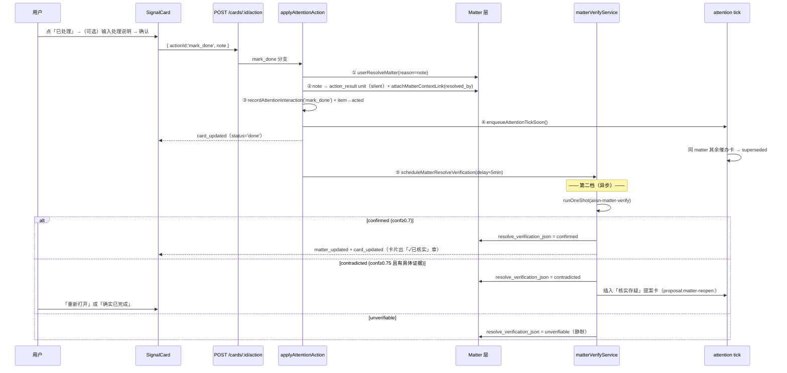

# MVP32 — 「已处理」闭环与办结核实技术方案

> 状态：已实施（M1+M2），三轮审查（自审 §13 + 开工前对码二审 + 实施后回归）。
> 验证：20 个新增单测 + 全量 510 测试通过；两端 tsc 通过；浏览器端到端走查
> （mark_done 带说明 → done 卡 +「已完成」pill → 撤销已处理 → 回待处理）全链路通过。
> 前置依赖：MVP26-29（Matter 状态层）、MVP31（办结提案回流通道）。
> 作者：Claude（与 xinming 讨论产出），2026-06-12

## 0. 一句话

给 attention 卡片补一个第一公民动作 **「已处理」(mark_done)**：用户在系统外做完一件被提醒的事后，一键把结论落到 **Matter 状态层**（resolved + 处理说明 + 证据链接），催办自动止血（第一档）；随后系统**异步核实**处理结果，有据可查时盖「已核实」章，发现反证时升「核实存疑」提案卡请用户裁决（第二档）。

## 1. 背景与问题

### 1.1 场景

待处理列表里有一张催办卡（如「回复张三关于 X 的消息」「提交 Y 文档」）。用户已经在系统外把事办了，现在想告诉系统"我处理完了"，并希望：

1. 系统把处理结果**记录下来、落库**，以后的推理能引用；
2. （可选）系统**帮忙核实**处理结果，确认事情真的闭环了。

### 1.2 现状按钮语义矩阵

| 按钮 | kind | 实际语义 | 用它表达"我做完了"的后果 |
|---|---|---|---|
| 知道了 | `ack` | attention item → `acted`，记一条 ack interaction（[cardsService.ts:423](../apps/server/src/cards/cardsService.ts)） | **Matter 仍 open**。催办从 Matter 长出来，下一轮 tick 可能再出新卡；commitmentAgent 只在 matter resolved 时跳过（[commitmentAgent.ts:69](../apps/server/src/agents/commitmentAgent.ts)）→ 还会被催 |
| 忽略 | `dismiss` | `not_relevant` 负反馈 + 相关实体降权（[cardsService.ts:402](../apps/server/src/cards/cardsService.ts)） | **教坏引擎**：把"关心但已完成"学成"不相关" |
| 确认办结 | `matter_resolve` | `userResolveMatter` → matter resolved → 下轮 tick 清掉全部催办卡 | 语义正确，但**只出现在 MVP31 提案卡**上（须先点「让 AI 处理」且 AI 聊出高置信 resolved 结论）。"系统外自己办完"这个最高频场景没有入口 |
| 让 AI 处理 | `ask_agent` | 起 topic 后台跑，标 acted | 能间接闭环（聊天里说"我处理完了"→ chatConclusionService 升办结提案卡），但绕一圈聊天 + 依赖 LLM 置信度 |

### 1.3 缺口

1. **没有"我做完了"的直达入口**——`mark_done` kind 在 [protocol.ts:55](../apps/server/src/claude/protocol.ts) 早已预留，但 attention 投影从不下发，`applyAttentionAction` 也没有对应分支。
2. **处理结果没有落库位**——用户"怎么处理的"这条信息今天只能消失在空气里。
3. **没有核实机制**——用户标记完成后系统全盘接受，无一致性检查。

## 2. 目标与非目标

### 目标

- G1（第一档）：attention 卡一键「已处理」，可附一句话处理说明；确定性落库（matter resolved + transition reason + action_result context unit + matter 证据链接），同事项催办卡自动清除。**零 LLM、点了即生效**。
- G2（第二档）：mark_done 后异步核实；`confirmed` 盖章可见，`contradicted` 升「核实存疑」提案卡（用户在环裁决），`unverifiable` 静默。**反证才打扰**。
- G3：已处理卡片在「已处理」抽屉显示「已完成」状态 + 「已核实」章 + 「撤销已处理」反悔通道。

### 非目标

- 不改 Matter Reducer 的自动状态机（晚到反证的自动 reopen 已有，见 §6.5）。
- 不给老 cards 表路径（`source_kind='agent_run'` 专项 agent 卡）加 mark_done 按钮（其 actions_json 在生卡时固化，且无 Matter 绑定，收益低）。
- 不做 Matter Panel 侧的核实入口（panel 的 `matter_done` 路径本期不挂核实，列为后续）。
- 不引入新的外部依赖 / 新表；只加一列 + 复用现有管线。

## 3. 依赖的既有设施（盘点）

| 设施 | 位置 | 本方案怎么用 |
|---|---|---|
| `userResolveMatter / userReopenMatter` | [matterActions.ts](../apps/server/src/matter/matterActions.ts)（confidence=1、`USER_TRIGGER` 哨兵、写 transitions、广播 matter_updated） | mark_done / 撤销 / 重开的状态落库通道 |
| `matter_transitions.reason` | matterStore.recordMatterTransition | 处理说明的**永久**落库位（不过期） |
| `matter_context_links` | matterStore.attachMatterContextLink（relation 含 `resolved_by` / `evidence` / `contradicted_by`） | 把"处理说明 unit"挂到 matter；也是核实 agent 的新鲜证据来源 |
| `action_result` ContextUnit + `card_action` origin | [ContextUnit.ts](../apps/server/src/context/ContextUnit.ts) | 处理说明的语义记忆载体（注意：30 天过期，见 §5.3） |
| MVP31 办结提案管线 | [chatConclusionService.ts](../apps/server/src/matter/chatConclusionService.ts)：`proposal:matter-resolve:` 前缀 + `insertAttentionItem(generation=0)` + 投影层按前缀给专属动作组 | 「核实存疑」提案卡完整复用此形态（前缀 `proposal:matter-reopen:`） |
| Matter Reducer 自动 reopen | [matterReducer.ts:271](../apps/server/src/matter/matterReducer.ts)：仅 resolved 可自动 reopen | 晚到反证（对方又追了消息）的兜底，第二档不重复造 |
| `markAttentionItemsSupersededForResolvedMatters` | attentionStore.ts:207，attention tick 内执行 | mark_done 后清同事项其余催办卡 |
| `enqueueAttentionTickSoon` | attentionEngine.ts | 让上面的清卡尽快发生 |
| `runOneShot` + opencode 单并发闸门 | [backgroundRuntime.ts:163](../apps/server/src/triage/backgroundRuntime.ts) | 核实 agent 的执行通道（自带排队，不会冲击主链路） |
| `attention_interactions` | attentionInteractions.ts（action 为自由 TEXT 列） | 记录 mark_done / matter_reopen 交互，供引擎学习 |
| `ensureColumn` | db.ts:504 | matters 表加 `resolve_verification_json` 列的迁移方式 |

## 4. 总体设计



**设计原则**

1. **分层正确**：「处理完了」是 Matter 生命周期事件，落 Matter 层；attention 卡只是投影。落对层后，清催办、防重提、可追溯全部免费。
2. **第一档确定性**：零 LLM、同步、幂等。用户动作是显式断言（沿用 matterActions 的 confidence=1 哲学）。
3. **第二档保守**：异步、延迟、有具体反证才打扰；**证据缺失 ≠ 反证**（采集器有延迟，见 §6.1）。提案卡宁缺毋滥，用户始终在环（沿用 MVP31 约束）。
4. **不二次发明**：晚到的反证走 Reducer 既有自动 reopen；核实 agent 的新鲜证据走 matter_context_links（Reducer 持续把新 unit 挂上来），不自建 events 查询。

## 5. 第一档：「已处理」+ 处理结果落库

### 5.1 交互（前端）

- **按钮出现条件**：attention 卡（`sourceKind==='agent_run'` 投影）且 `item.matterId != null`，非提案卡。无 matter 绑定的卡不出（"已处理"对它没有额外效力，避免按钮通胀；见 §13-R2）。
- **位置**：动作组第一个，在「知道了」左侧：`[已处理] [知道了] [角度…] [忽略] [指令框]`。
- **点击后**：footer 展开第二行 inline 输入（复用 `correction-inline` 样式）：
  - 输入框 placeholder：`（可选）一句话：怎么处理的？`
  - 按钮：`[确认] [取消]`；Enter 提交；留空提交 = 无说明。
- **提交后**：卡片状态变 `done`，移入「已处理」抽屉，状态 pill 显示「已完成」（`statusLabel` 已有此文案）。

### 5.2 后端动作语义

`applyAttentionAction`（[cardsService.ts:312](../apps/server/src/cards/cardsService.ts)）新增 `mark_done` 分支，顺序敏感：

```ts
if (action.kind === 'mark_done') {
  const note = opts?.note?.trim().slice(0, 2000) || undefined;

  // ⚠️ MVP29D：attention_items.matter_id 可能是 LLM 截断的 8 位前缀（supersede SQL 因此用 LIKE 兜底）。
  //   所有 matter 操作前先 canonical 化；解不出（歧义/已删）→ 按无 matter 卡兜底处理。
  const fullMatterId = attn.matterId ? matchMatterId(attn.matterId) : null;

  // ① 先落 Matter（在写 note unit 之前，见 §5.4 echo 防护）
  if (fullMatterId) {
    const m = getMatterById(fullMatterId);
    if (m && m.status !== 'resolved' && m.status !== 'dropped') {
      userResolveMatter(fullMatterId, note ? `用户标记已处理：${note}` : '用户标记已处理', now);
    } // 已 resolved → 幂等跳过，不写重复 transition（matterActions.applyStatus 无同态守卫，守卫放本层）
  }

  // ② 处理说明 → action_result unit（silent，不触发 upsert hooks）+ 挂到 matter
  if (note) {
    const { unit } = upsertContextUnit({
      kind: 'action_result',
      origin: { kind: 'card_action', refId: attn.id },
      title: `已处理：${attn.title.slice(0, 60)}`,
      content: note,
      scope: 'work',
      actionability: 'record',
      confidence: 1,
      mergeHint: `mark-done:${attn.id}`,   // 幂等：重复提交合并为同一 unit
      silent: true,                          // 新增参数，见 §5.4
    });
    if (fullMatterId) {
      attachMatterContextLink({
        matterId: fullMatterId, contextUnitId: unit.id,
        relation: 'resolved_by', effect: 'resolve',
        confidence: 1, reason: '用户标记已处理时填写的处理说明', now,
      });
    }
  }

  // ③ 交互记录 + 卡片状态
  recordAttentionInteraction(attn, 'mark_done', now);   // 枚举扩充，见 §7
  const updated = updateAttentionItemStatus(attn.id, 'acted', now);
  if (!updated) return { ok: false, error: 'update failed' };

  // ④ 尽快清同事项其余催办卡
  enqueueAttentionTickSoon();

  // ⑤ 第二档挂钩（异步、可配置关闭）；传 canonical 化后的完整 matter id
  if (fullMatterId && config.matterVerifyEnabled) {
    scheduleMatterResolveVerification({ matterId: fullMatterId, attentionId: attn.id, userNote: note });
  }

  const card = projectAttentionItemToCard(updated);
  broadcast({ type: 'card_updated', card });
  return { ok: true, card };
}
```

无 `matterId` 的卡防御性兜底：若 mark_done 仍打到这种卡（如旧前端缓存），走 ①跳过 + ②不挂链接（unit 仍写）+ ③④⑤照常（⑤不触发）。

### 5.3 处理说明的落库模型（三个位置，各司其职）

| 落库位 | 生命周期 | 用途 |
|---|---|---|
| `matter_transitions.reason`（`用户标记已处理：<note>`） | **永久** | 审计 / Matter 时间线 / "这事怎么收尾的"权威记录 |
| `action_result` ContextUnit（origin=`card_action`） | 30 天过期（`defaultExpiresAt`，不对抗） | 近期语义记忆：Work Map / active context / 检索能召回"我上周怎么处理 X 的" |
| `matter_context_links`（relation=`resolved_by`） | 永久 | matter ↔ 处理说明的结构化关联；核实 agent 与后续 Reducer 推理的证据 |

> 30 天过期是接受而非缺陷：长期权威记录在 transitions（不过期）；unit 过期只影响泛化检索，符合 `action_result` 的既有语义（[ContextUnit.ts:119](../apps/server/src/context/ContextUnit.ts)）。不为此引入特殊 expiry。

### 5.4 `upsertContextUnit` 的 `silent` 选项（echo 防护）

`upsertContextUnit` 在写入后会 `invokeHook`（contextStore.ts:224/266），订阅者包括 **matterReducer**（matterScheduler 注册）。不加防护的后果：mark_done 写入的 note unit 会再触发一次 Reducer LLM 调用，对一个**刚被用户确定性 resolve 的 matter** 重新做 LLM 状态判定——纯浪费（一次 LLM 调用）+ 可能写出第二条 resolve transition 噪声。

方案：`UpsertContextUnitInput` 增加 `silent?: boolean`，为 true 时跳过 `invokeHook`（routing materialize 不受影响——`card_action` origin 本来就不走）。**仅限"状态已被确定性通道同步落库"的用户断言 unit 使用**，在参数 doc comment 里写明此约束，防滥用。

### 5.5 投影与状态映射

**目标**：mark_done 后的卡在「已处理」抽屉里诚实地显示「已完成」而非「已查看」，并承载「已核实」章与撤销入口。

1. `projectAttentionItemToCard`（attentionProjection.ts）：
   - item `status==='acted'` 且 matter `status==='resolved'` → 卡片投影 `status:'done'`（其余 acted 仍 → `acknowledged`）。matter 查找统一走 `matchMatterId(item.matterId)` canonical 化（截断前缀兜底，见 §5.2 ⚠️）；`mapAttentionStatus` 保持纯函数不动，分支写在 projection 内（它本就做 db 读，+1~2 次单行查询可接受）。
   - 新增透出 `verification`：读 matter `resolve_verification_json`，仅当存在时填 `{ verdict, evidence, checkedAt }`。
   - 副作用说明：经 ask_agent → AI 聊天 → MVP31 确认办结的 acted 卡也会投成 `done`——语义正确（事确实结了），属顺带修正。
2. `App.tsx:171` 可见性过滤：`c.status !== 'dismissed' && c.status !== 'done'` → 仅排除 `dismissed`。`done` 卡进「已处理」抽屉。
   - 行为变更说明：老 cards 表中因飞书任务完成同步而 `done` 的卡（larkTaskService.ts:363）从"直接消失"变为"显示在已处理抽屉"——视为改进，无需兼容层。
3. `SignalCard.tsx`：
   - `isAcked` 集合加入 `'done'`。
   - `status==='done'` 且为 attention 卡时，acked 动作组用 `{ id:'matter_reopen', label:'撤销已处理', kind:'matter_reopen' }` **替代** `REOPEN_ACTION`（`__reopen` 对 attention item 本就不可用——applyAttentionAction 查不到该 action 会报错，这是既有 bug，本方案顺带绕开；且即便能置回 live，matter 仍 resolved，下轮 tick 又会把卡 supersede，必须从 matter 层撤销才有意义）。
   - `verification.verdict==='confirmed'` → 标题行加 `✓ 已核实` pill（hover 显示 evidence）。

### 5.6 API 变更

- `POST /api/cards/:id/action` body 增加可选 `note: string`（≤2000，trim）；routes/cards.ts 透传。
- `applyCardAction / applyAttentionAction` 的 `opts` 扩为 `{ extraPrompt?: string; note?: string }`。
- web `postCardAction` 同步加 `note`；`App.tsx onCardAction` / `SignalCard run()` 的 opts 类型同步。

## 6. 第二档：办结核实

### 6.1 触发与时机

- 触发点：mark_done 成功且有 `matterId`（§5.2 第⑤步）。MVP31 确认办结路径**不触发**——那条链路的 resolve 本身就来自 AI 结论 + 用户确认，再核实是自我循环。
- **延迟执行，默认 5 分钟**（`matterVerifyDelayMs`）。理由：用户"刚刚"在系统外做完动作（如刚回了消息），IM collector 默认 3 分钟一轮（config.ts `imIntervalMs=180_000`），延迟一轮让新证据先进 events → Reducer → matter_context_links，核实 agent 才看得到。
- 实现：进程内 `setTimeout` + 待核实集合去重（同 matterId 只挂一个 timer）。
- **重启恢复**：timer 不持久化，但 `startMatterVerifyService()`（index.ts 启动时调用，与 `startChatConclusionService` 并列）做一次扫描：

```sql
-- cutoffIso 由 JS 计算（now - 24h 的 ISO 字符串）后以参数传入
SELECT m.id FROM matters m
WHERE m.status='resolved' AND m.resolve_verification_json IS NULL
  AND EXISTS (SELECT 1 FROM matter_transitions t
              WHERE t.matter_id=m.id AND t.to_status='resolved'
                AND t.trigger_context_unit_id='user_action'
                AND t.created_at > ?)
```

  命中者以 10–60s 随机抖动重新排程。窗口外的不补（核实是增强不是义务）。
  - ⚠️ 截止时间在 **JS 侧**算好以 ISO 字符串入参（`new Date(Date.now() - 24h).toISOString()`），不要用 SQLite `datetime('now','-24 hours')`——库里 created_at 是 ISO-T 格式，与 `datetime()` 的空格格式做字符串比较会在日界附近失真。
  - 恢复路径拿不到 mark_done 时的 `userNote`：从该 matter 最近一条 `user_action → resolved` 的 transition reason 解析（`用户标记已处理：` 前缀后的部分）。

### 6.2 核实 agent

- 注册：`agents.ts` 增加 `'aiisn-matter-verify'`，`permission: READ_ONLY`，prompt 来自新文件 `matterVerifyPrompt.ts`。模型走 `runOneShot` 默认（`config.opencodeModel`），超时 `matterVerifyTimeoutMs`（默认 90s，与 chat-conclusion 一致）。
- 输入拼装（`matterVerifyService.buildVerifyInput`）：

```
【事项】title / status / currentSummary / nextAction / resolvedAt
【用户声明】用户于 {resolvedAt} 标记该事项已处理。处理说明：{note ?? '（未填写）'}
【事项最近证据】matter_context_links 最新 ≤10 个 unit（time + kind + title + content≤200 字）
                ——排除 mark_done 写入的 note unit（链接 relation='resolved_by' 且 unit.origin.kind='card_action'），
                  防循环自证；该规则不依赖 attentionId，恢复扫描路径同样适用
【状态轨迹】matter_transitions 最新 ≤6 条（from→to + reason≤80 字）
【提醒卡原始信号】resolveAttentionSignalDetails(item.signalIds) ≤6 条（title + excerpt）
```

- 输出（严格单 JSON，解析器 `parseVerifyVerdict` 仿 chatConclusion 的 `parseVerdict`，独立实现——verdict 枚举不同，不强行抽象）：

```json
{ "verdict": "confirmed" | "unverifiable" | "contradicted",
  "confidence": 0.0-1.0,
  "evidence": "≤120 字，必须摘自输入文本" }
```

- Prompt 铁律（全文写在 matterVerifyPrompt.ts，要点）：
  1. **证据缺失 ≠ 反证**。找不到完成证据 → `unverifiable`，绝不因"没看到"判 `contradicted`（采集有延迟）。
  2. `contradicted` 必须有**具体的、晚于或独立于用户声明**的反证（如对方在用户声明的处理动作之后仍在追问、交付物明确显示未完成）。
  3. 仅用户自己的声明（处理说明）不能作为 `confirmed` 的证据——那是待验证的命题本身 → `unverifiable`。
  4. evidence 必须摘自输入，禁止脑补。

### 6.3 三种 verdict 的处置

| verdict | 门槛 | 动作 | 用户感知 |
|---|---|---|---|
| `confirmed` | conf ≥ 0.70 | 写 `resolve_verification_json`；broadcast `matter_updated` + 重投影该 attention 卡 broadcast `card_updated` | 已处理抽屉卡片出现「✓ 已核实」章 |
| `contradicted` | conf ≥ 0.75 **且** evidence 非空 | 写 verification；插入「核实存疑」提案卡（§6.4）；broadcast `attention_updated` | 待处理列表出现一张 P1 提案卡 |
| `unverifiable`（或解析失败 / 不到门槛降级） | — | 写 verification（verdict=unverifiable）便于排查与后续重验 | 无感知（不打扰） |

运行前守卫（全部静默跳过 + 日志）：matter 不存在 / `status !== 'resolved'`（已被 Reducer 自动 reopen 或用户撤销）/ `resolve_verification_json` 已存在 / 配置关闭。

### 6.4 「核实存疑」提案卡

完整复用 MVP31 提案卡形态：

- `inputHash = 'proposal:matter-reopen:' + matterId`（常量 `MATTER_REOPEN_PROPOSAL_PREFIX`）；插入前查同 hash 的 live item 去重（同 MVP31）。
- `insertAttentionItem({ generation: 0, llmRunId: null, llmItem: { priority:'P1', title:'核实存疑：'+matter.title.slice(0,40), why:'你已标记该事项已处理，但核实发现：'+evidence.slice(0,120)+'。请确认是否重新打开跟进。', suggestedAction:'重新打开，或确认确实已完成', signalIds:[], matterId } })`
- 投影动作组（attentionProjection.defaultAttentionActions 加前缀分支）：

```ts
if (item.inputHash.startsWith(MATTER_REOPEN_PROPOSAL_PREFIX)) {
  return [
    { id: 'matter_reopen', label: '重新打开', kind: 'matter_reopen' },
    { id: 'dismiss', label: '确实已完成', kind: 'dismiss' },
  ];
}
```

- `applyAttentionAction` 两个动作的语义：
  - ⚠️ **动作合法性**：`done` 状态原卡上的「撤销已处理」是前端合成动作，不在 `defaultAttentionActions(attn)` 的返回里——必须像现有 `ask_agent` 兜底（cardsService.ts:322）一样，给 `actionId==='matter_reopen'` 加 fallback 合法化，否则会落到 `unknown action`（`__reopen` 的旧坑不能再踩一次）。
  - **`matter_reopen`**（新 kind，复用于两处，按 inputHash 区分善后；matterId 一律先 `matchMatterId` canonical 化）：
    - 在重开提案卡上：`userReopenMatter(matterId, '核实存疑，用户确认重开')` → 提案卡自身 `acted`；原催办由下轮 attention tick 对 active matter 自然重生，不手工复活旧卡。
    - 在 `done` 状态的原卡上（「撤销已处理」）：`userReopenMatter(matterId, '用户撤销已处理')` → **该 item 置回 `live`**（卡片回到待处理）。
    - 两处都 `recordAttentionInteraction(attn, 'matter_reopen')` + `enqueueAttentionTickSoon()`。matter 非 resolved 时幂等跳过 reopen 只动卡片状态。
  - **`dismiss`（确实已完成）**：扩展现有提案卡白名单判断（`isResolveProposal` → `isProposalCard`，两个前缀都算）：**不走 not_relevant 负反馈**（用户没说内容不相关，只是裁决核实结论错了）；额外把 `resolve_verification_json.verdict` 更新为 `'user_confirmed'`；item → `dismissed`。

### 6.5 与 Matter Reducer 自动 reopen 的分工（重要边界）

| 时间窗 | 反证如何被发现 | 机制 |
|---|---|---|
| mark_done 后 ~5 分钟（核实时点） | **已采集**的信号中存在反证 | 本方案第二档（一次性、点状） |
| 之后任意时刻 | 新信号进入 → Reducer 判 reopen（仅 resolved 可自动 reopen，matterReducer.ts:271） | **既有机制，不改动** |

即：第二档只负责"核实这一下"；持续监控不重复建设。被 Reducer 自动 reopen 的 matter 会自然长出新催办卡，churn guard 按 matterId 等价合并（attentionEngine.ts:273），无重复卡风险。

### 6.6 核实结果落库

- `matters` 表新增列 `resolve_verification_json TEXT`（`ensureColumn` 迁移，nullable）。
- 类型（matterTypes.ts）：

```ts
export type MatterResolveVerification = {
  verdict: 'confirmed' | 'unverifiable' | 'contradicted' | 'user_confirmed';
  confidence: number;
  evidence: string;
  checkedAt: string;      // ISO
  userNote?: string;      // 核实时用户的处理说明快照
};
```

- 写入用**专用** `setMatterResolveVerification(matterId, v)`（matterStore 新函数，单列 UPDATE）。
- ⚠️ 实现注意：`saveMatter` 若按固定列全量 UPDATE，必须确认它**不触碰**新列（否则 Reducer 后续 saveMatter 会把 verification 清掉）。`rowToMatter` 增加 `resolveVerification?` 字段的水合。

## 7. 数据模型与类型变更汇总

| 文件 | 变更 |
|---|---|
| db.ts | `ensureColumn('matters','resolve_verification_json','TEXT')`；attention_interactions 注释行（:903）补 `'mark_done' \| 'matter_reopen'` |
| matterTypes.ts | `MatterResolveVerification` 类型；`Matter` 加 `resolveVerification?` |
| matterStore.ts | `setMatterResolveVerification`；`rowToMatter` 水合；核对 `saveMatter` 列集 |
| attentionInteractions.ts | `AttentionInteractionAction` 加 `'mark_done' \| 'matter_reopen'`；`coerceAction` 同步 |
| protocol.ts（server）/ types.ts（web） | `CardActionKind` 加 `'matter_reopen'`（`mark_done` 已有）；`SignalCard` 加 `verification?: { verdict: string; evidence?: string; checkedAt: string }` |
| contextStore.ts | `UpsertContextUnitInput.silent?: boolean` |

## 8. 改动文件清单

### 后端（apps/server/src）

| 文件 | 改动 |
|---|---|
| attention/attentionProjection.ts | ① matterId 卡动作组头部插 `mark_done`；② `MATTER_REOPEN_PROPOSAL_PREFIX` 分支动作组；③ projection：acted+resolved→`done`、透出 `verification` |
| cards/cardsService.ts | `applyAttentionAction` 加 `mark_done` / `matter_reopen` 分支；dismiss 的提案卡白名单扩成双前缀；`opts.note` 透传 |
| matter/matterVerifyService.ts（新） | schedule / run / 启动恢复扫描 / 提案卡插入 / `parseVerifyVerdict`；依赖注入 `deps?: { runShot?: typeof runOneShot }` 便于测试 |
| matter/matterVerifyPrompt.ts（新） | 核实 system prompt（§6.2 铁律） |
| matter/chatConclusionService.ts | 顺带修复（一行）：`getMatterById(attn.matterId)` → 先 `matchMatterId` canonical 化。现状对截断前缀的 matterId 会静默跳过办结提案（MVP31 潜伏 bug，自审 R13 发现）。不挂核实（§6.1） |
| opencode/agents.ts | 注册 `aiisn-matter-verify`（READ_ONLY） |
| config.ts | §9 三个配置项 |
| routes/cards.ts | body 读 `note` |
| index.ts | `startMatterVerifyService()` |

### 前端（apps/web/src）

| 文件 | 改动 |
|---|---|
| components/SignalCard.tsx | `mark_done` 按钮 + inline note 输入；`isAcked` 含 `done`；done 卡「撤销已处理」替代「标记未读」；「✓ 已核实」pill |
| components/CardList.tsx | `processed` 抽屉过滤加入 `'done'`（CardList.tsx:53，二审 R15：漏改则 done 卡两个分组都不显示） |
| App.tsx | `applyCard` 可见性过滤放行 `done`（App.tsx:171）；`onCardAction` opts 加 `note` |
| lib/api.ts | `postCardAction` 加 `note` |
| types.ts | 同 protocol.ts 镜像 |
| styles（对应 css） | `.status-pill--verified`、mark-done inline 行（复用 correction-inline） |

## 9. 配置项

| 配置 | env | 默认 | 说明 |
|---|---|---|---|
| `matterVerifyEnabled` | `MATTER_VERIFY_ENABLED` | `true` | 第二档总开关（第一档无开关——它是核心语义） |
| `matterVerifyDelayMs` | `MATTER_VERIFY_DELAY_MS` | `300_000` | mark_done → 核实的延迟（≥ IM collector 一轮） |
| `matterVerifyTimeoutMs` | `MATTER_VERIFY_TIMEOUT_MS` | `90_000` | one-shot 超时，对齐 chat-conclusion |

置信门槛（0.70 / 0.75）作为模块常量，不进 config——与 MVP31 的 `CONFIDENCE_GATE` 同策略。

## 10. 边界情况与风险

| # | 场景 | 处置 |
|---|---|---|
| 1 | 重复点「已处理」/ 网络重试 | matter 已 resolved → 跳过 resolve（无重复 transition）；note unit 走 mergeHint 幂等合并；interaction 多一条（无害，真实反映点击） |
| 2 | note unit 触发 Reducer echo | `silent: true` 跳过 hooks（§5.4） |
| 3 | 核实运行时 matter 已被 Reducer 自动 reopen / 用户撤销 | 运行前守卫 `status==='resolved'`，否则静默跳过 |
| 4 | 核实把"没证据"当反证 → 误打扰 | prompt 铁律 1/2 + conf 0.75 + evidence 非空三重门；解析失败一律 unverifiable |
| 5 | 重开提案卡重复 | inputHash live 去重（同 MVP31） |
| 6 | 服务重启丢核实 timer | 启动扫描补 24h 窗口（§6.1） |
| 7 | 核实 LLM 排队挤占主链路 | runOneShot 走既有单并发闸门，非 priority；延迟本身就摊平了峰值 |
| 8 | 用户在「核实存疑」卡上点忽略被学成负反馈 | dismiss 白名单扩双前缀，不走 not_relevant |
| 9 | `done` 卡上的旧「标记未读」按钮（`__reopen` 对 attention 本就报错的既有 bug） | done 卡改挂 `matter_reopen`（撤销已处理）；`acknowledged` 卡维持现状，bug 修复另立（不扩本方案范围） |
| 10 | mark_done 打到无 matterId 卡（旧缓存） | 防御性兜底：只标 acted + 记 interaction（§5.2 尾注） |
| 11 | note 含恶意指令注入核实 prompt | note 是用户本人输入、≤2000 字、核实 agent READ_ONLY 且输出仅 JSON verdict——风险面可接受，不额外消毒 |
| 12 | 「已处理」抽屉刷新后清空（GET /cards 只回 live） | 既有行为（acked 卡同样如此），本方案不扩 API；如需持久抽屉另立需求 |
| 13 | `attention_items.matter_id` 是 LLM 截断的 8 位前缀（MVP29D 已知现象） | 所有 matter 操作入口统一 `matchMatterId` canonical 化（mark_done / matter_reopen / 核实 / 投影）；解不出 → 按无 matter 卡兜底，不抛错 |

## 11. 测试计划（node:test，apps/server/test/）

**mvp32-mark-done-action.test.ts**
1. mark_done（带 note）：matter → resolved；transition reason 含 note；action_result unit 存在且 mergeKey 幂等；matter_context_link relation=resolved_by；interaction action=mark_done；item→acted；投影 status='done'。
2. mark_done（无 note）：不写 unit；其余同上。
3. 重复 mark_done：matter_transitions 不新增第二条 resolved 记录。
4. 无 matterId 卡 mark_done：不抛错、acted、无 matter 写入。
5. silent upsert：注册一个探针 hook，断言未被调用。

**mvp32-matter-verify.test.ts**（runOneShot 用 DI 假实现）
6. confirmed ≥0.7 → verification 落库 verdict=confirmed。
7. contradicted ≥0.75 + evidence → 重开提案卡插入（hash 正确、P1、matterId 透传）；再次运行不重复插卡。
8. contradicted 但 conf<0.75 / evidence 空 → 降级 unverifiable、不出卡。
9. 核实前 matter 被 reopen → 跳过、verification 不写。
10. `parseVerifyVerdict`：合法 / 包裹文本 / 非法 JSON / 未知 verdict。
11. 启动恢复扫描：构造 24h 内 user_action resolve 无 verification 的 matter → 被排程；有 verification / 超窗 → 不排。

**mvp32-reopen-proposal-actions.test.ts**
12. 重开提案卡动作组 = [matter_reopen, dismiss]；普通 matter 卡动作组头部含 mark_done；resolve 提案卡不含 mark_done。
13. 提案卡 matter_reopen：matter→`in_progress`（`userReopenMatter` 的目标态，reopened_count+1）、提案卡 acted。
14. done 原卡 matter_reopen（撤销）：matter→`in_progress`、item→live；动作不在投影动作组里也合法（fallback，§6.4 ⚠️）。
15. 重开提案卡 dismiss：无 not_relevant 反馈记录；verification.verdict→user_confirmed。
16. 截断前缀 matterId（8 位）：mark_done 仍能 resolve 到完整 matter；投影 status='done' 正常。

**前端**：无既有组件测试设施，走 `tsc` 类型检查 + preview 手动验证（mark_done 流、pill、撤销、提案卡）。

## 12. 落地顺序

- **M1（第一档，独立可交付）**：§5 全部 + §7 中除 verification 外的类型变更 + `matter_reopen` 的"撤销已处理"分支 + 测试 1–5、12（mark_done 动作组部分）、14、16。交付后即解决"点哪个按钮"的核心痛点。
- **M2（第二档）**：§6 全部 + verification 类型/列 + 重开提案卡 + 测试 6–11、12（提案卡动作组部分）、13、15。依赖 M1 的 mark_done 挂钩点与 `matter_reopen` kind。

两档一个 PR 分两个 commit，或两个 PR 均可；M1 不依赖 M2 的任何 schema。

## 13. 自审记录（adversarial self-review）

写完初稿后按"实现者视角逐条过引用 + 攻击者视角找反例"做了一轮自审，发现并已修订进上文的问题：

| # | 发现 | 严重度 | 修订 |
|---|---|---|---|
| R1 | 初稿把核实做成"自查 events 找新消息"——重复造 Reducer 已有的证据管线，且 events 按 chatId 过滤的实现复杂 | 设计 | 改为核实 agent 只读 matter_context_links（Reducer 持续挂新证据）+ 冻结的原始信号；§4 原则 4、§6.2 |
| R2 | 初稿给**所有** attention 卡加 mark_done——无 matter 卡上它与「知道了」效果几乎相同，按钮通胀 | UX | 收敛为仅 matterId 卡出按钮 + 后端防御兜底（§5.1、风险 10） |
| R3 | `upsertContextUnit` 写 note 会触发 matterReducer hook → 对刚 resolve 的 matter 再跑一次 LLM 判定（echo） | 正确性/成本 | 新增 `silent` 参数（§5.4），并加测试 5 |
| R4 | `matterActions.applyStatus` 无同态守卫：重复 mark_done 会写重复 resolved transition | 正确性 | 幂等守卫放 mark_done 分支（已 resolved 跳过），加测试 3 |
| R5 | 投影 `done` 后卡片会被 App.tsx:171 的过滤**整个隐藏**（初稿没发现 `done` 在隐藏集合里），「已核实」章无处安放 | 正确性 | 过滤放行 `done` 进已处理抽屉；连带处理老 lark-task done 卡的行为变更声明（§5.5-2） |
| R6 | `done` 卡沿用「标记未读」(`__reopen`) ——该动作对 attention item 会直接报 unknown action（既有 bug），且即使置回 live，matter 仍 resolved，下轮 tick 又会清卡，"未读"无意义 | 正确性 | done 卡改挂 `matter_reopen`「撤销已处理」，从 matter 层撤销（§5.5-3、§6.4）；`acknowledged` 卡的既有 bug 不扩范围 |
| R7 | 核实 agent 可能拿用户自己的 note 当 confirmed 证据（循环自证），或把"没找到证据"判成反证（采集延迟必然造成） | 误报 | 铁律 1/3 + 证据块排除 note unit + 延迟 5 分钟对齐 imIntervalMs（§6.1、§6.2） |
| R8 | MVP31 确认办结路径若也挂核实 → AI 核实 AI 自己的结论 | 设计 | 显式排除（§6.1） |
| R9 | `saveMatter` 全量列 UPDATE 可能清掉 verification 列 | 实现风险 | 专用单列 UPDATE + 实现期核对 saveMatter 列集（§6.6 ⚠️） |
| R10 | 核实 timer 重启即丢，"已处理但永远没核实"无感知 | 健壮性 | 启动 24h 窗口恢复扫描 + unverifiable 也落库（可观测）（§6.1、§6.3） |
| R11 | `action_result` unit 30 天过期，初稿误当永久落库位宣传 | 文档诚实 | §5.3 明确三个落库位的生命周期分工，权威记录定位在 transitions |
| R12 | done 卡上的「撤销已处理」是前端合成动作，不在 `defaultAttentionActions` 返回里——按初稿实现会落到 `unknown action`（与 `__reopen` 同坑） | 正确性 | `applyAttentionAction` 给 `matter_reopen` 加 fallback 合法化（仿 ask_agent 兜底，§6.4 ⚠️），测试 14 覆盖 |
| R13 | `attention_items.matter_id` 可能是 LLM 截断的 8 位前缀（MVP29D supersede SQL 用 LIKE 兜底即为此）——初稿所有 `getMatterById(attn.matterId)` 在引擎产催办卡上会静默 miss；**连带发现 MVP31 chatConclusionService 已存在同款潜伏 bug** | 正确性（高） | 所有 matter 操作统一 `matchMatterId` canonical 化（§5.2/§5.5/§6.4、风险 13、测试 16）；chatConclusionService 一行顺带修复（§8） |
| R14 | 启动恢复 SQL 初稿用 `datetime('now','-24 hours')` 与 ISO-T 字符串比较，日界附近失真 | 正确性（低） | 截止时间 JS 侧算好以参数传入（§6.1）；恢复路径 userNote 改从 transition reason 解析 |

自审后仍保留的已知取舍（非缺陷）：风险表 #11（note 注入面小，不消毒）、#12（抽屉刷新清空是既有行为）、置信门槛不进 config（与 MVP31 一致）、`acknowledged` 卡上 `__reopen` 既有 bug 不在本期修。

### 二审（开工前逐条对照代码）

| # | 发现 | 修订 |
|---|---|---|
| R15 | 前端清单漏了 CardList.tsx:53——「已处理」抽屉过滤只认 `acknowledged \|\| snoozed`，done 卡会从两个分组都消失 | §8 前端清单补 CardList.tsx |
| R16 | `userReopenMatter` 的目标态是 `in_progress`（非泛称 active），测试断言精确化 | §11 测试 13/14 |
| — | 实现期注意（better-sqlite3 命名参数对**多余 key 会抛错**）：`MatterRow.resolve_verification_json` 必须是可选字段且 `matterToRow` **不映射**它，否则 `insertMatter`/`updateMatter` 的命名参数 SQL 全部炸 | §6.6 已有 ⚠️ 的具体化 |

二审同时过码确认（无需改动）：`updateMatter` 显式列集不含新列（R9 成立）；`ServerEvent` 已含 `card_updated`/`attention_updated`/`matter_updated`；`syncOpencodeAgents()` 启动物化 agent 文件（index.ts:89），注册进 `AGENTS` 数组即生效；`UpsertContextUnitInput = ContextUnitDraft & {subjectId?, scope, origin}` 与 §5.2 草图字段吻合；`updateAttentionItemStatus` 为无守卫 setter，acted→live 可行；测试 harness 模式为 `SQLITE_PATH` 临时库 + `npx tsx --test` + 动态 import；`startChatConclusionService()`（index.ts:118）后插 `startMatterVerifyService()`。
